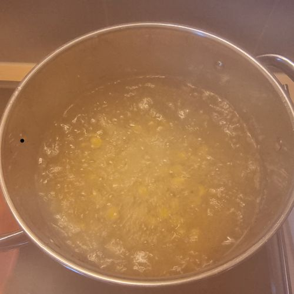

# Houmous

## Infos

Source : https://www.marmiton.org/recettes/recette_houmous-puree-de-pois-chiches_29761.aspx

La masse des pois chiches est 2 à 3 fois plus élevées après hydratation.

## Recette

-  250 g           pois chiches secs
-    1 l           eau

> faire tremper 12 h à température ambiante, \
> rincer, puis égoutter dans une passoire

-    2 dl          eau
-    1 feuille     laurier
-    1 gousse      ail
-    2 cc          sel
-    2 cc          poivre

> mélanger, \
> porter à ébullition, \
> saler et poivrer à mi-cuisson, \
> laisser cuire 1 h 30 à 2 h, \
> égoutter et conserver l’eau de cuisson, \
> réduire en purée, \
> chauffer à feu doux dans une casserole,

-   10 cl          huile tiède
-  qqe cl          jus de cuisson
-  qqe cl          jus de citron

> incorporer l’huile en fouettant, \
> allonger un peu de jus de cuisson et du jus de citron

-    3 gousses     ail
-    2 cs          huile
-    1 pincée      piment

> piler l’ail au mortier avec l’huile, \
> ajouter la préparation dans la casserole hors du feu, \
> saupoudrer le piment

## Notes

—

